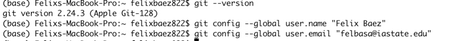

Hi my name is **Felix Baez** and I am a junior year *Data Science* student. My interests include history, longboarding, videogames and listening to music. I am originally from a small town in Puerto Rico. My favorite thing to do is to go on longboarding sessions by myself and just think a lot about life in general. 

A job I think that requires Data Science is pretty much any job related to statistics or anything AI related. Big companies understand the power of data and strive to understand it when making big decisions. A particular field that looks very interesting to me is Data Engineering. Here is the link: https://expertsystem.com/machine-learning-definition/#:~:text=Machine%20learning%20is%20an%20application,use%20it%20learn%20for%20themselves.


The data science topic Im most interested in is anything that has to do with demographics and economics. Many government programs can greatly benefit from the power of data science. There are too many outdated ways of approaching real world problems that could easily be solved with machine learning.
```{r}
`version`

```


my git user name is felbasa